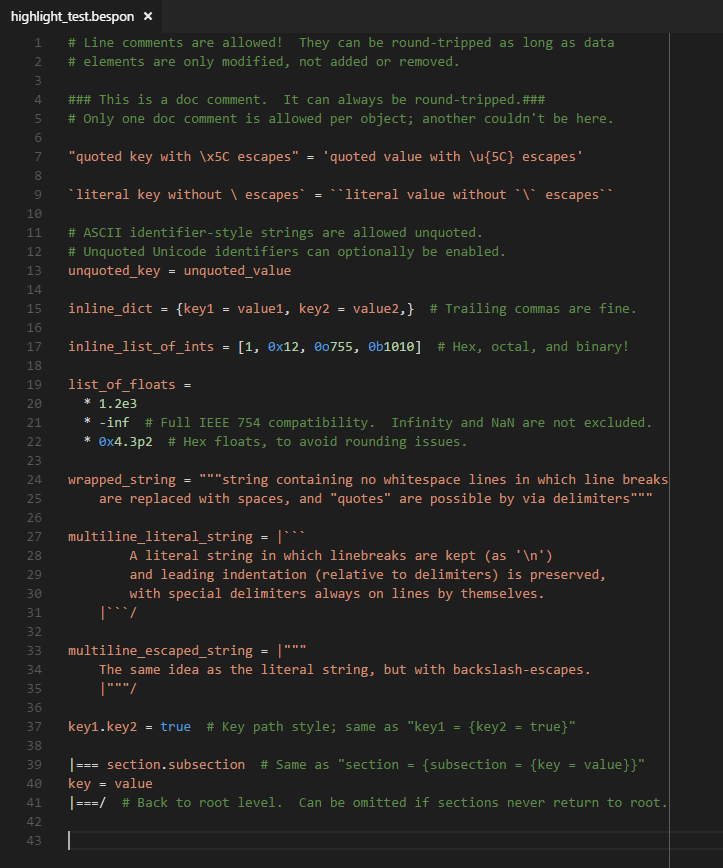

# BespON syntax highlighting for VS Code

This is an extension for [VS Code](https://code.visualstudio.com/) that
provides basic syntax highlighting for [BespON](https://bespon.org/).

A simple installation script `install.py` is provided to automate manual
installation.

